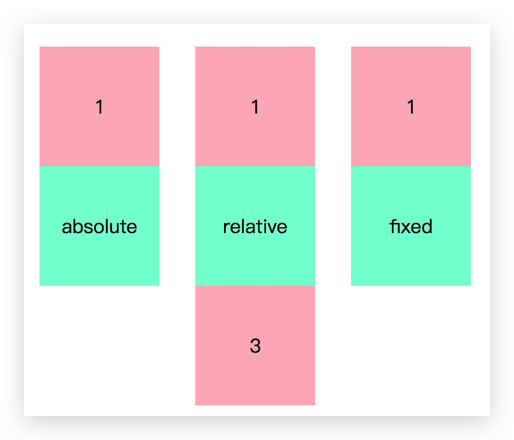
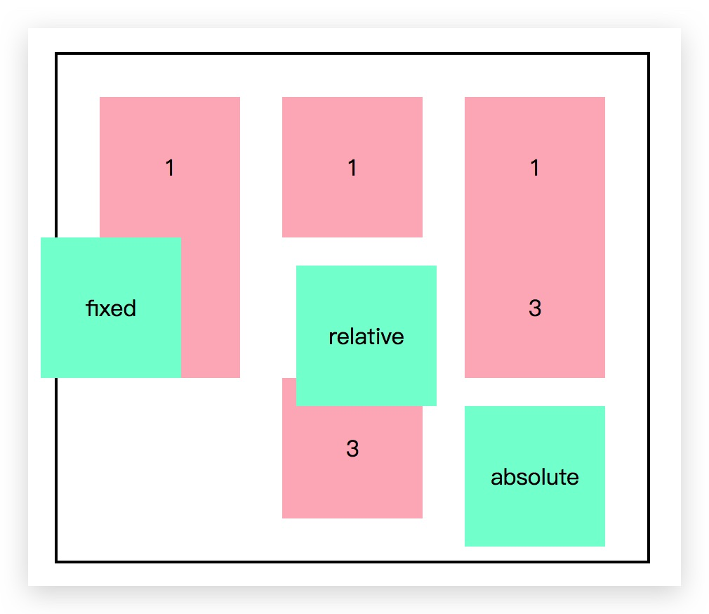
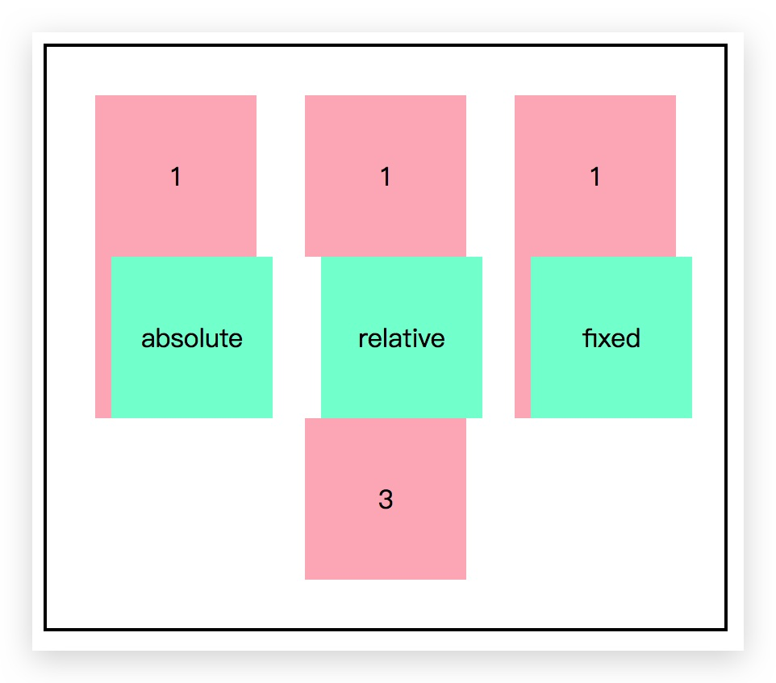
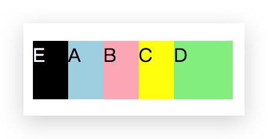
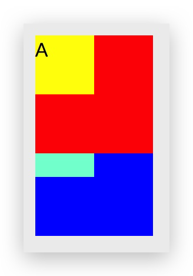

# 前端范式重构之position

### 1.position 

其实在写这个之前，我就在想着重点是什么。想来想去，例子还是最重要，所以本篇博文的目的就是以自己的理解去对比三个不同的 `positon`属性——**absolute**、**relative**、**fixed**，尽量去涵盖极大多数的容易让人误解的区域，而定义和用法则会浅浅带过。

这是 learncss 中文文档的定义，简洁明了。

| 值       | 描述                                                         |
| -------- | :----------------------------------------------------------- |
| absolute | 生成绝对定位的元素，相对于 static 定位以外的第一个父元素进行定位。元素的位置通过 "left", "top", "right" 以及 "bottom" 属性进行规定。 |
| fixed    | 生成绝对定位的元素，相对于浏览器窗口进行定位。元素的位置通过 "left", "top", "right" 以及 "bottom" 属性进行规定。 |
| relative | 生成相对定位的元素，相对于其正常位置进行定位。因此，"left:20" 会向元素的 LEFT 位置添加 20 像素。 |
| static   | 默认值。没有定位，元素出现在正常的流中（忽略 top, bottom, left, right 或者 z-index 声明）。 |
| inherit  | 规定应该从父元素继承 position 属性的值。                     |

文档流这个概念，相信你们会比我更熟悉，脱离文档流的方式有两种：**浮动**和**定位**，这里只介绍定位，对浮动感兴趣的可以看看 Febible 系列上一篇博文。当然，如果你认为只要带上`position`属性就能脱离文档那你就大错特错了。事实上，只有定位为`absolute`和`fixed`的层才会脱离正常文本流，而`relative`以及默认的`static`则不会，先来个栗子吧！

html部分代码：

```html
<body>
  <ul>
    <li>
      <div class="first">1</div>
      <div style="position:absolute;width:100px;height: 100px;background: aquamarine">absolute</div>
      <div class="third">3</div>
    </li>
    <li>
      <div class="first">1</div>
      <div style="position:relative;width:100px;height: 100px;background: aquamarine">relative</div>
      <div class="third">3</div>
    </li>
    <li>
      <div class="first">1</div>
      <div style="position:fixed;width:100px;height: 100px;background: aquamarine">fixed</div>
      <div class="third">3</div>
    </li>
  </ul>
</body>
```

css代码：

```css
ul li {
	float: left;
	margin-left: 30px;
	margin-top: 30px;
	width: 100px;
	text-align: center;
	line-height: 100px;
}
.first,.third {
	width:100px;
	height: 100px;
	background: lightpink;
}

```

效果图：



简单地解释一下，由于`relative`定义的元素不会脱离文档流，就算设置了`left`等值，它依然占着位置，`li`标签中第三块元素也就会按正常顺序由上而下排列，并不会被第二块元素所覆盖，而被设置为`absolute`和`fixed`的块状元素就会凌驾于第三块元素之上。这里我们可以猜出，`absolute`的一个妙用，它可以实现一个类似弹窗的功能，这里就不再举例。

在这里给个小提示，拿`fixed`举例，**top**的值表示对象上边框与浏览器窗口顶部的距离，**bottom**的值表示对象下边框与浏览器窗口底部的距离，两者同时存在时，只有**top**起作用，**left**和**right**的值同时存在时，只有**left**起作用。

同时值得注意的是，如果并没有对top、right、bottom、left （下面简称为TRBL）进行设置的话，特殊定位仅仅起到设置层级显示的作用，其所处位置与原先位置一致；如果TRBL已经设置，三个不同的值相对移动对象也不相同，就像上面的定义讲到，`relative`相对于初始位置，`fixed`相对于屏幕，`absolute`则比较特殊，在它没有`static`定位以外的父元素时，`absolute`也相对于屏幕，不然则相对于特殊定位的父元素。

不得不多说一句，这里要区分`top`和`margin-top`，`margin`属性的用法还是跟普通元素相同的，并不会相对这儿相对那儿的，废话不多说，所谓一图解千言。

html部分代码：

```html
<div style="border: 2px solid black;width: 420px;position: relative;margin-left: 20px;margin-top: 20px;">
  <ul>
    <li>
      <div class="first">1</div>
      <div style="position:absolute;width:100px;height: 100px;background: aquamarine;right: 30px;bottom: 10px;">absolute</div>
      <div class="third">3</div>
    </li>
    <li>
      <div class="first">1</div>
      <div style="position:relative;width:100px;height: 100px;background: aquamarine;left: 10px;top: 20px;">relative</div>
      <div class="third">3</div>
    </li>
    <li>
      <div class="first">1</div>
      <div style="position:fixed;width:100px;height: 100px;background: aquamarine;left: 10px;">fixed</div>
      <div class="third">3</div>
    </li>
  </ul>
</div>
```

css代码：

```css
ul li {
	float: left;
	margin-left: 30px;
	margin-top: 30px;
	margin-bottom: 30px;
	width: 100px;
	text-align: center;
	line-height: 100px;
}
.first,.third {
	width:100px;
	height: 100px;
	background: lightpink;
}
ul:after {
	content: "";
	display: block;
	clear: both;
}
```

效果图：



现在只设置`margin-left: 10px`，就会出现以下结果：



### 2.z-index

说到`positon`我们不得不扯到`z-index`属性,因为它仅在`positon`属性不为`static`时起作用。前面已经讲到，`absolute`和`fixed`会让元素脱离文档流，这两个修饰的元素默认层级自然比文档流的要高，而`relative`则不会脱离文档流，但也可以看出当设置了 TRBL 时它也会覆盖文档流，其默认层级自然也是比后者要高的，**脱离文档流和层级的概念不能混淆**。

#### 2.1.同级原则

所谓同级，顾名思义，也就是同级间层级的比较，一个元素`position`不为`static`后，如果不给它的`z-index`设定值，默认为0，由下图可以看到，A 元素设定了`z-index`为0，B元素未设定，E 元素设定了`z-index`为负数，按照顺序 B 覆盖住了 A，而E则被A盖住。往后则是`z-index`大的把小的覆盖。



在此仅展示结构，css 代码则省去。

```html
<div id="1" style="position: absolute;z-index: 0">A</div>
<div id="2" style="position: absolute">B</div>
<div id="3" style="position: absolute;z-index: 1">C</div>
<div id="4" style="position: absolute;z-index: 2">D</div>
<div id="5" style="position: absolute;z-index: -1">E</div>
```

#### 2.2.多级原则

看到这个标题，你可能会问，这是啥意思？其实很简单，它的意思是，要比较的元素不再是简单的同级概念，而是其中一个或两者都有祖先元素。看看下面这个代码：

```html
<div id="1" style="position:relative;z-index:2;">
  <div id="1-1" style="position:relative;z-index:1;">A</div>
</div>

<div id="2" style="position:relative;z-index:1;">
  <div id="2-1" style="position:relative;z-index:999;">B</div>
</div>
```

效果图：



可见，A、B父元素的层级影响了相应的子元素的层级，就算 B 的`z-index`设的再大，它的父元素的`z-index`总是小于 A 的父元素的`z-index`值，这时候不论 A 的`z-index`怎么变化，元素 A 就会像图中一样一直压着 B，这就是从父原则。不过这里要划一下重点，这里的父元素不一定要同级，换句话说，两个元素间的层级比较，是**相应的的同级祖先元素各自往下找到第一个`position`不为`static`的的两个元素之间的比较**。

举个栗子：

```html
<div id="1" style="position:relative;z-index:2;">
  <div id="1-1" style="position:relative;z-index:1;">A</div>
</div>

<div>
  <div id="2" style="position:relative;z-index:1;">
  	<div id="2-1" style="position:relative;z-index:999;">B</div>
  </div>
</div>

```

这个上面例子实现的效果是一样的，凡事都要明白其本质，切忌模棱两可。

这下相信很多人都会明白自己将某元素`z-index`设定成999999都没达到效果的原因了吧！